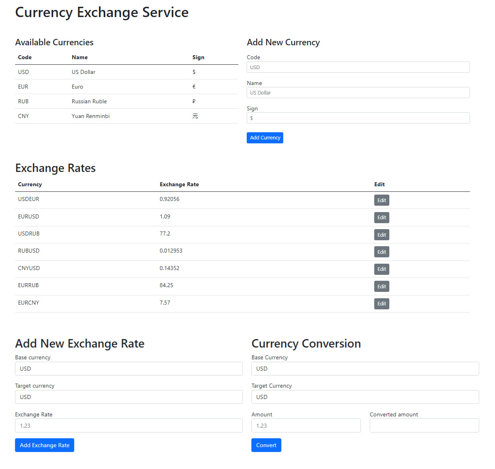

# currency-exchange-service
Currency exchange service : REST API, ASP.NET Core, MySQL.Data, ConnectionPool, MySQL

# Swagger documentation
<a href="https://localhost:7234/swagger/index.html"> Social media API OpenAPI specification <a/>

### Application is available at <a href="https://localhost:7155/"> currency-exchange <a/>

# Техническое задание
REST API для описания валют и обменных курсов. Позволяет просматривать и редактировать списки валют и обменных курсов, и совершать расчёт конвертации произвольных сумм из одной валюты в другую.

# REST API
#### - GET /currencies
Получение списка валют.

#### - GET /currency/EUR
Получение конкретной валюты.

#### - POST /currencies
Добавление новой валюты в базу. Данные передаются в теле запроса в виде полей формы (x-www-form-urlencoded). Поля формы - name, code, sign. 

#### - GET /exchangeRates
Получение списка всех обменных курсов. 

#### - GET /exchangeRate/USDRUB
Получение конкретного обменного курса. Валютная пара задаётся идущими подряд кодами валют в адресе запроса. 

#### - POST /exchangeRates
Добавление нового обменного курса в базу. Данные передаются в теле запроса в виде полей формы (x-www-form-urlencoded). Поля формы - baseCurrencyCode, targetCurrencyCode, rate.

#### - PATCH /exchangeRate/USDRUB
Обновление существующего в базе обменного курса. Валютная пара задаётся идущими подряд кодами валют в адресе запроса. Данные передаются в теле запроса в виде полей формы (x-www-form-urlencoded). Единственное поле формы - rate.

#### - GET /exchange?from=BASE_CURRENCY_CODE&to=TARGET_CURRENCY_CODE&amount=$AMOUNT
Расчёт перевода определённого количества средств из одной валюты в другую. Пример запроса - GET /exchange/from=USD&to=AUD&amount=10.

#### Получение курса для обмена может пройти по одному из двух сценариев. Допустим, совершаем перевод из валюты A в валюту B:

В таблице ExchangeRates существует валютная пара AB - берём её курс
В таблице ExchangeRates существует валютная пара BA - берем её курс, и считаем обратный, чтобы получить AB
